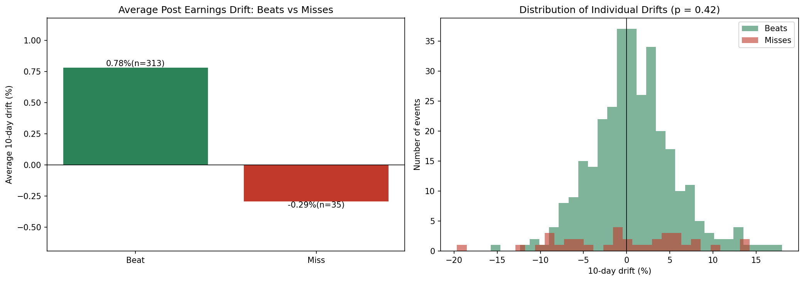

# earnings-drift-study-

# Post-Earnings Announcement Drift: An Event Study

Testing whether stocks that beat earnings expectations keep drifting upward in the days that follow — and whether that difference is real or just noise. Built in Python as a personal learning project.

**Short version:** beats drifted +0.78% and misses −0.29% over the following 10 trading days, but the difference was **not statistically significant** (p = 0.42). In this sample, there was no reliable, tradeable drift.

---

## Objective

Post-earnings announcement drift (PEAD) is a well-documented anomaly: the tendency of stocks to continue moving in the direction of an earnings surprise *after* the announcement. This project tests whether that effect is detectable in recent data on large-cap US stocks.

## Method

- **Universe:** 15 large-cap US stocks (AAPL, MSFT, GOOGL, AMZN, META, NVDA, JPM, V, WMT, PG, HD, KO, PEP, DIS, NKE).
- **Data:** Earnings announcement dates and surprise percentages via `yfinance`; daily adjusted closing prices for the same tickers, 2019–2026.
- **Sample:** 348 past earnings events with a recorded surprise value.
- **Grouping:** Each event classified as a **beat** (positive surprise) or **miss** (negative surprise).
- **Drift window:** Return from the close of the market's *reaction day* to 10 trading days later.
- **Excluding the untradeable jump:** Most companies report after the close, so the initial price reaction happens on the next trading day and is not capturable by an outside investor. Drift is therefore measured *starting from* the reaction-day close, deliberately excluding the announcement gap. Including it would inflate the result with returns that were never available.
- **Test:** Welch's t-test comparing mean drift for beats vs. misses.

## Results

| Group | Mean 10-day drift | n |
|---|---|---|
| Beat | **+0.78%** | 313 |
| Miss | **−0.29%** | 35 |

- Difference: ~1.07 percentage points
- t-statistic: **0.815**
- p-value: **0.4200** — not significant at the 5% level

## Conclusion

The raw averages point in the direction PEAD predicts: beats drifted up, misses drifted down. But the difference is **indistinguishable from random variation**. A p-value of 0.42 means a gap this large would appear roughly 42% of the time even if there were no underlying effect.

Two observations reinforce that:

1. **The distributions overlap heavily.** The right-hand histogram shows both groups forming wide, largely overlapping clouds centred near zero. Individual outcomes ranged from about −20% to +18%, dwarfing the ~1 point difference in averages.
2. **The result was unstable across data pulls.** Re-running the pipeline produced p-values of 0.31 and 0.42 on slightly different samples. A signal that moves that much between pulls of the same data was never a stable one — a useful illustration of sampling variation in practice.

This is consistent with efficient-market expectations. PEAD is one of the most-studied anomalies in finance, and the easily-accessible large-cap version of it has been heavily arbitraged over decades. Finding no exploitable edge in 15 mega-cap names is the expected outcome, not a failed experiment.

## Limitations

- **Small and imbalanced sample** — only 35 misses versus 313 beats, so the miss estimate is especially fragile. Large caps beat expectations roughly 90% of the time, since management guides conservatively.
- **Large caps only** — PEAD has historically been found more in smaller, less-liquid stocks. "No effect here" does not mean "no effect anywhere."
- **Single horizon** — only a 10-day drift window was tested; other horizons might behave differently.
- **Entry assumption** — drift is measured from the reaction-day close, assuming execution at that price.
- **No transaction costs** — costs would only weaken an already-insignificant result.
- **Recent period only** — roughly 2020–2026, a span with unusual market conditions.

## Reproducibility

Live data pulls returned slightly different samples across runs, so the final dataset is frozen in `drift_data.csv`. All figures above trace to that single dataset.

## Tools

Python, pandas, yfinance, matplotlib, scipy. Built and run in Google Colab.

## How to run

1. Open the notebook in Google Colab (or Jupyter).
2. Install the data library: `!pip install yfinance`
3. Run the cells top to bottom. To reproduce the exact figures above, load `drift_data.csv` rather than re-pulling live data.
